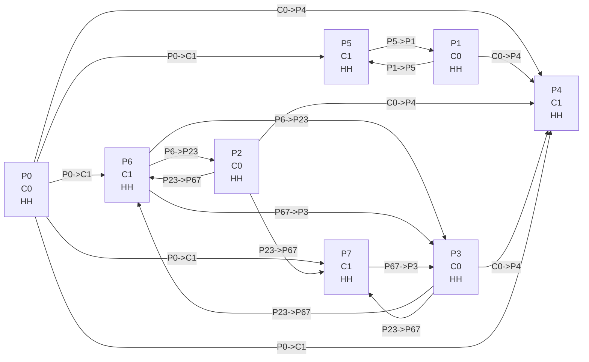

```mermaid
graph LR
    P0["P0<br/>C0<br/>HH"]
    P1["P1<br/>C0<br/>HH"]
    P2["P2<br/>C0<br/>HH"]
    P3["P3<br/>C0<br/>HH"]
    P4["P4<br/>C1<br/>HH"]
    P5["P5<br/>C1<br/>HH"]
    P6["P6<br/>C1<br/>HH"]
    P7["P7<br/>C1<br/>HH"]
    P0 -->|C0->P4| P4
    P1 -->|C0->P4| P4
    P2 -->|C0->P4| P4
    P3 -->|C0->P4| P4
    P0 -->|P0->C1| P4
    P0 -->|P0->C1| P5
    P0 -->|P0->C1| P6
    P0 -->|P0->C1| P7
    P1 -->|P1->P5| P5
    P5 -->|P5->P1| P1
    P2 -->|P23->P67| P6
    P2 -->|P23->P67| P7
    P3 -->|P23->P67| P6
    P3 -->|P23->P67| P7
    P6 -->|P6->P23| P2
    P6 -->|P6->P23| P3
    P6 -->|P67->P3| P3
    P7 -->|P67->P3| P3
```