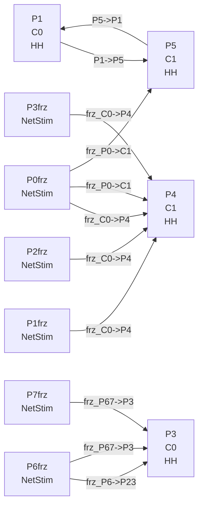

  
  <!-- your info text, absolutely positioned inside the container -->
  

    Active: P1, P3, P4, P5
  

```mermaid
graph LR
    P1["P1<br/>C0<br/>HH"]
    P3["P3<br/>C0<br/>HH"]
    P4["P4<br/>C1<br/>HH"]
    P5["P5<br/>C1<br/>HH"]
    P2frz["P2frz<br/>NetStim"]
    P0frz["P0frz<br/>NetStim"]
    P3frz["P3frz<br/>NetStim"]
    P1frz["P1frz<br/>NetStim"]
    P7frz["P7frz<br/>NetStim"]
    P6frz["P6frz<br/>NetStim"]
    P0frz -->|frz_C0->P4| P4
    P1frz -->|frz_C0->P4| P4
    P2frz -->|frz_C0->P4| P4
    P3frz -->|frz_C0->P4| P4
    P0frz -->|frz_P0->C1| P4
    P0frz -->|frz_P0->C1| P5
    P1 -->|P1->P5| P5
    P5 -->|P5->P1| P1
    P6frz -->|frz_P6->P23| P3
    P6frz -->|frz_P67->P3| P3
    P7frz -->|frz_P67->P3| P3
```