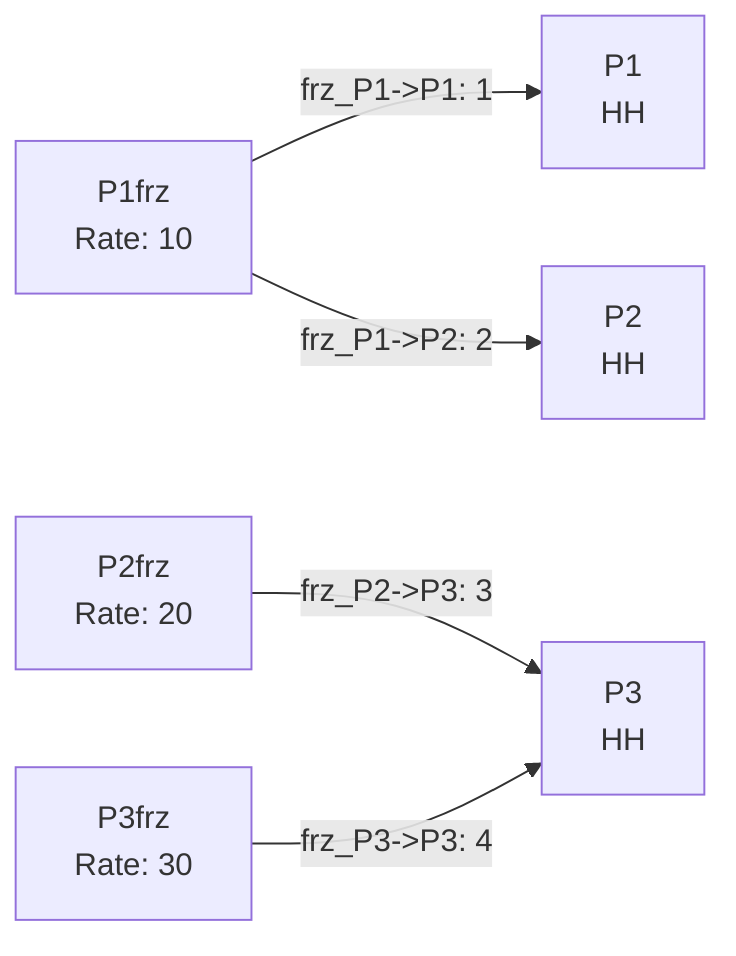

```mermaid
graph LR
    P1["P1<br/>HH"]
    P2["P2<br/>HH"]
    P3["P3<br/>HH"]
    P1frz["P1frz<br/>Rate: 10"]
    P3frz["P3frz<br/>Rate: 30"]
    P2frz["P2frz<br/>Rate: 20"]
    P1frz -->|frz_P1->P1: 1| P1
    P1frz -->|frz_P1->P2: 2| P2
    P2frz -->|frz_P2->P3: 3| P3
    P3frz -->|frz_P3->P3: 4| P3
```